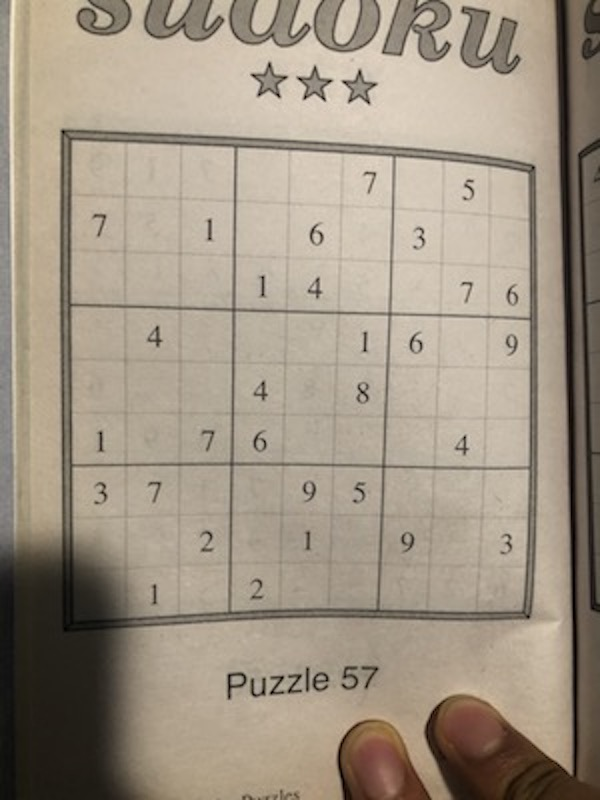

# Sudoku-Solver

To solve a grid: `python3 runner.py `
ex. `python3 runner.py imgs/sudoku1.jpeg`

To train a model: `python3 train.py train`

To test a model: `python3 train.py test <model_path>`
ex. `python3 runner.py test ./model`

`python3 runner.py imgs/sudoku1.jpeg`

The Solved Grid:
-------------------------------
| 4  6  3 | 9  8  7 | 2  5  1 |
| 7  8  1 | 5  6  2 | 3  9  4 |
| 2  9  5 | 1  4  3 | 8  7  6 |
----------+---------+----------
| 5  4  8 | 3  7  1 | 6  2  9 |
| 6  2  9 | 4  5  8 | 1  3  7 |
| 1  3  7 | 6  2  9 | 5  4  8 |
----------+---------+----------
| 3  7  6 | 8  9  5 | 4  1  2 |
| 8  5  2 | 7  1  4 | 9  6  3 |
| 9  1  4 | 2  3  6 | 7  8  5 |
-------------------------------
